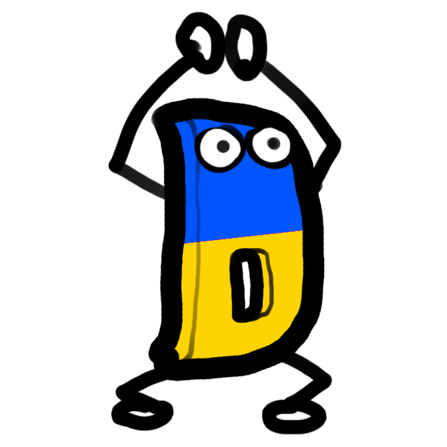
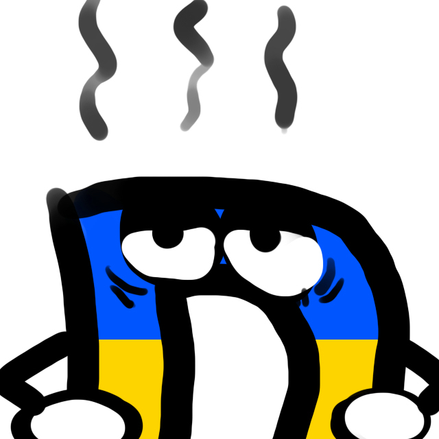
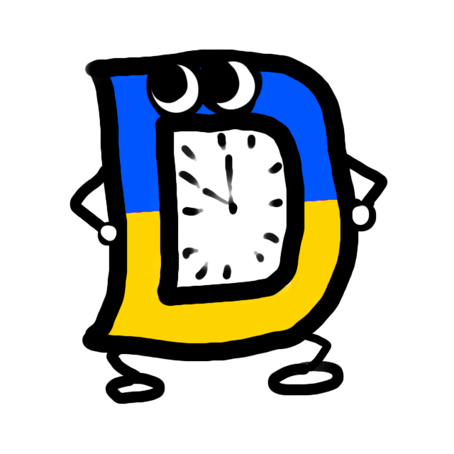

<table>
  <tr>
    <td></td>
    <td></td>
    <td></td>
  </tr>
</table>

> [Collection of D-Man drawings](https://github.com/dlang-community/d-mans) by [@meiz_sandwich](https://twitter.com/meiz_sandwich) -- Modified to #StandWithUkraine

Hey there :wave:,

Check out my [about page](https://lsferreira.net/about/).

---
Keep it Simple
